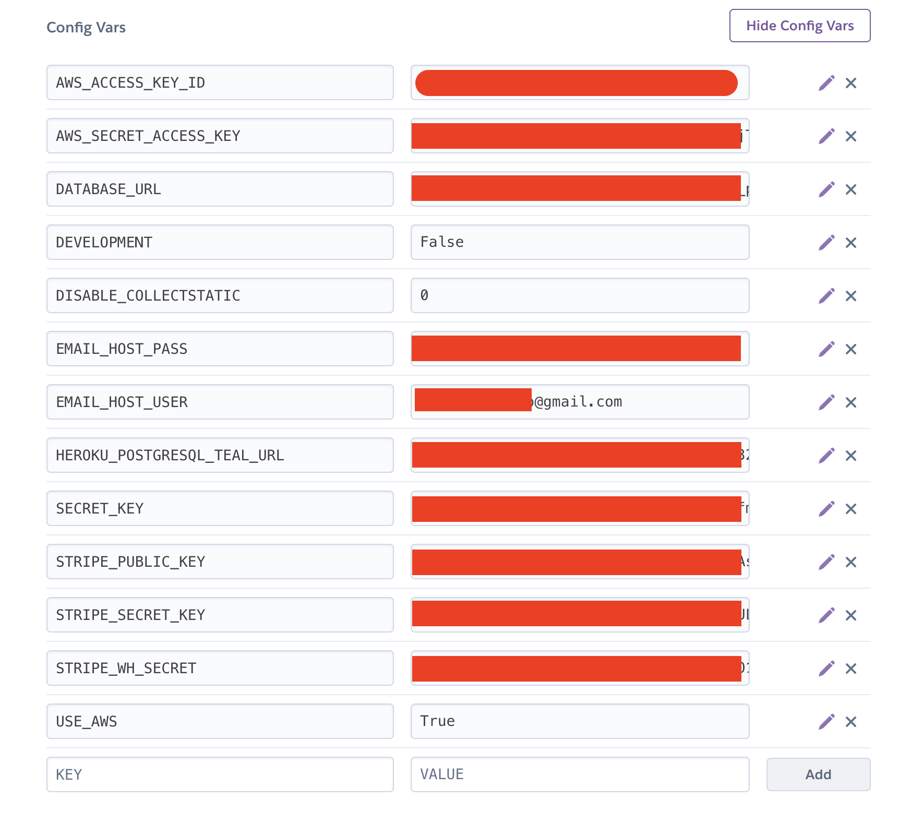

# Deployment Guide

This project was coded locally on VS Code and is deployed using Heroku. The static files are hosted on AWS using S3. Should you wish to to recreate this app, you could code locally or in your own IDE. Additionally, hosting with Heroku and AWS are only two options out there. 

## Steps for Deployment:
#### Initial Setup
1. If you do not have an account with [Github](https://github.com/), create an account, log in, and then return to this page.
2. At the top of this page, click the button that says 'Fork' and copy this repository to your own account.
3. At this point you will need to decide if you want to code locally (using a locally IDE like [VS Code](https://code.visualstudio.com/)) or use an online IDE (such as [Gitpod](https://www.gitpod.io/)).
   1. If you decide to use an online IDE like [Gitpod](https://www.gitpod.io/), navigate to the IDE's website, create an account and follow all the instructions they provide on how to connect your Gitpod account to your Github account. Once you have done this, you can return to your Github account, navigate to the newly created repository forked from this one, and then click the green button in the top right corner that says 'Gitpod'. Clicking on this will launch your online IDE and get you set up to code.
   2. If you decide to code locally, it's a bit more complicated. 
      1. Firstly, you need to make sure you have [VS Code](https://code.visualstudio.com/) or your preferred IDE installed on your computer. You will then need to clone your Github repository to your computer. If you need help doing this, [this video](https://www.youtube.com/watch?v=icfevBYas9s&ab_channel=LearnToCode) provides a good overview of how to do this.
      2. After cloning the repository to your local device, you can open it in VS Code (or your chosen editor). Before you begin coding, you will need to set up a virtual environment. [This article by VS Code](https://code.visualstudio.com/docs/python/environments) provides a great overview of how to set up the virtual environment. It is important that you do not skip this step since, if you go on to install any package or third-party apps on this project, you could install them onto your local device which could potentially affect how other projects you work on operate.
      3. Once your virtual environment is set up, you should install django by typing the command `python -m pip install Django` in your terminal where the virtual enviroment is running. Any time you install another third-party app, make sure to freeze it to your requirements.txt file with the line `pip freeze > requirements.txt`.
4. Now you can make any changes to the project so that it matches your desired goals. Whenever you wish to push (i.e., save) your project, do so with this series of commands in the terminal:
   1. `git add .`
   2. `git commit -m "Type your message here explaining the changes you've made"`
   3. `git push`

#### Setting up a Database
1. Create a free account with [Elephantsql](https://www.elephantsql.com/), or log in if you already have an account. This is where your databases will be hosted.
2. Obtain a database url. To do this, first click the 'create new instance' button on the home/dashboard page of Elephantsql. Name the database what you like (ideally the same name as the app you're making), select the 'Tiny Turtle' or free plan, select your region and then submit the form. After this, you can obtain the database url by clicking on your new database and lookin under where it says 'URL'. Make sure to copy this database url as it will be needed later.
3. Add the database url to your env.py file.

#### Set Up Stripe
1. Sign into [Stripe](https://dashboard.stripe.com/login), or create an account and then sign in and then go to the home tab.
2. Go to the developers section. Here you will find two values–1. the stripe secret key and 2. the stripe public key. You will need to copy these and have them ready later. For now, go ahead and save them to your env.py file so that you can access them locally when the project is not yet deployed.
3. In the developer section, click on webhooks and add a new end point. The url for this end point should be https://nameofyourwebsite.com/checkout/wh/. Then select the events this webhook will receive and add the end point.
4. Run tests to make sure your webhook is working. As stripe is always updating their system, it is best to read their current documentation if you get confused.


#### Set Up Heroku
1. Sign into [Heroku](https://www.heroku.com/home), or create an account and then sign in.
2. Create a new app by clicking on the box in the top right corner that says 'New' and then selecting 'Create New App'. Fill out the information required by giving the app a name and selecting your preferred region.
3. Navigate to the setting tab and click on 'Reveal Config Vars'. Begin adding the config variables you have gathered so far (database url, stripe secret key, stripe public key, stripe webhook secret). The config vars you will eventually have will be:

4. Generate a unique secret key with [this website](https://djecrety.ir/).
5. Add all the config variables so far to the env.py file in your code. 

#### Set up Amazon S3
1. Sign into [AWS](https://aws.amazon.com/), or create an account and then sign in.
2. Create bucket
   1. Click on services in the top left corner, then storage, then S3. Click on 'Create Bucket'
   2. Name the bucket after your project, select the nearest region to you.
   3.  Where it says "Object Ownership", click "ACLS enabled", for the "Block Public Access settings for this bucket" section, uncheck "Block all public access". Then check the box confirming you know that this will make the bucket public.
3. Edit bucket settings and permissions
   1. First, open your newly made bucket. Click on the "Properties" tab and where it says "Static website hosting", click "Edit".
   2. Where it says "Static website hosting" click "Enable". Where it says "Hosting type", select "Host a static website". Where it says "Index document", enter "index.html". Save these changes.
   3. Click where it says "Permissions". Click 'edit' on the "CORS configuration" section. In the box, paste this bit of code:
      ```JSON
            [
                {
                    "AllowedHeaders": [
                    "Authorization"
                    ],
                    "AllowedMethods": [
                    "GET"
                    ],
                    "AllowedOrigins": [
                    "*"
                    ],
                    "ExposeHeaders": []
                }
            ]
        ```
   4. Click "Save changes". Go to the "Bucket Policy" section and click "Edit". Copy of the "Bucket ARN". Click where it says "Policy Generator". First where it says "Select Policy Type" click "S3 Bucket Policy." from the drop down menu. Then, under step 2 "Add Statement(s)" enter " * " in the "Principal" box. From the "s3:Action" drop down menu click "s3:GetObject". Paste the "Bucket ARN" from the bucket policy into the "Amazon Resource Name (ARN)" box. Click "Add Statement". Under Step 3 "Generate Policy", click "Generate Policy". Copy the generated policy, then paste it into the bucket policy box on the previous tab along with "/*" at the end of the resource key so as to allow access to everything in the bucket.Save your changes.
   5. Go to the permissions tab, then click to edit the "Access Control List" section. Enable "List" for "Everyone (public access)". Accept the box where it says "I understand the effects of these changes on my objects and buckets". Save your changes.
4. Create user and assign user to the S3 bucket
   1. On the landing page, click where it says "Services", then on "Security, Identity, & Compliance", then on "IAM". Click "User Groups" where it says "Access management", the click "Create Group". Enter your desired username. Click "Create Group."
   2. Then click on "Policies" in the menu and click "Create Policy." Click "Import managed policy". Search for "AmazonS3FullAccess", click "Import". Click "JSON" under "Policy Document". Copy the ARN from the bucket policy page, then paste this into the "Resource" section of the JSON snippet. Remove the value of the resource key (" * ") and replace it with the ARN. Copy the ARN a again into the "Resource" section of the JSON snippet. This time, add "/*" to the end of the ARN so as to allow access to everything in the bucket. Click "Next: Tags" and "Next: Review". Click "Review Policy" and give a name and description for the policy. Finally, click "Create Policy".
   3. Click "User Groups" in the menu. Click on your user group. Click "Permissions" and then "Attach Policy". Search for and select the policy just created. Attach the policy.
   4. Click "Users" in the menu and then "Add user". Provide a "User name". Click "Programmatic access" and "AWS Management Console access". Click "Next", select "Add user to group" and select the recently made user group.Click "Next: Tags", "Next: Review" and the click "Create user". Copy the "Access key ID" and "Secret access key". These are needed to connect to the S3 bucket.Download the csv file. Close out.
5. Return to Heroku and upload the relevant aws config variables to the config vars. 
6. Go to the deploy tab in Heroku. Where it says 'Deployment method', click to connect you github account. Once connected, select your project's github repo and click deploy. If you wish to set up automatic deployment, you can click that below.


#### Set up gmail
If you want this app to be able to send emails (and for the user registration to work), you will need to set up email for it. This instructional follows Gmail, since that is the one I used and think is the easiest.

1. If you wish to create a new Gmail account for your app, go ahead and create a new [Google](https://www.google.com/) account (ideally named after your project). Otherwise, you can just use your personal email address. 
2. Navigate to your Gmail. Then click the settings wheel in the top right corner, then 'Accounts and Import', then 'Other Google Account Settings'.
3. Go to the 'Security' tab. Switch on Google two-step authentification. You will have to set up this two-factor authentification in order to create an app password that can be used to connect the Gmail account to your new app. 
4. Once two-factor authentification is set up, go to the [app password generator](https://myaccount.google.com/apppasswords). For the dropdown box named 'select app', click 'Mail'; for 'device', select 'other'. Name this app whatever you want (I named mine 'django'). You will receive a 16-character password. Make sure to copy this as you can't view it again and would have to generate another password if you lost it.
5. Finally, go back to Heroku and enter this 16-character password as a config variable. At this point your config variables should be full and look like the list of config vars below, but with your details filled in.
