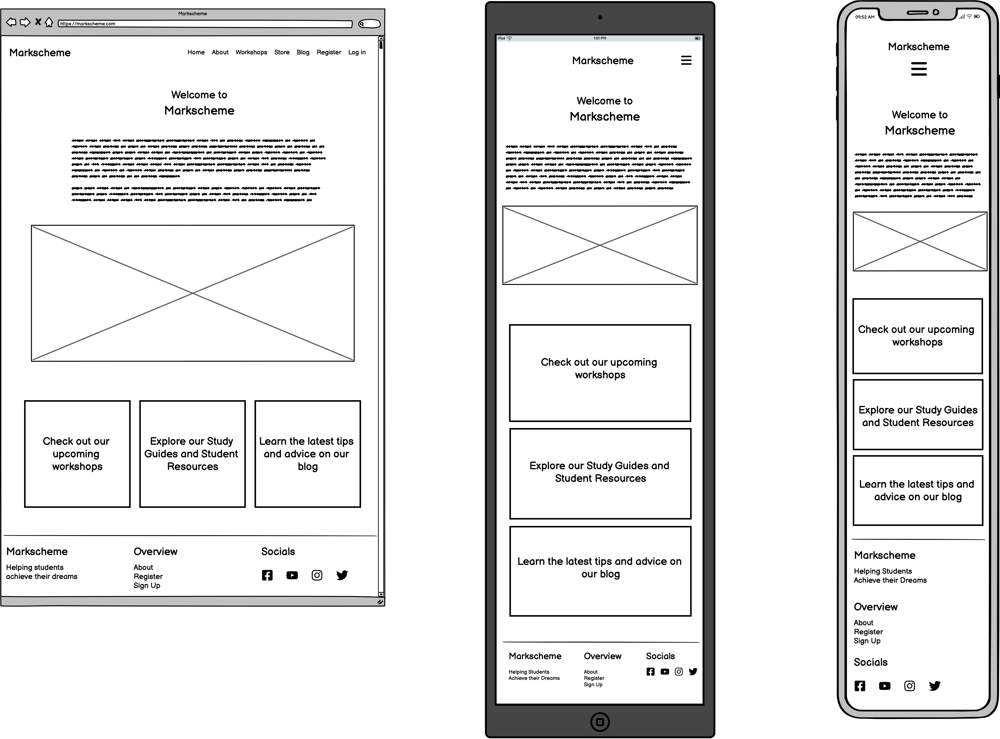
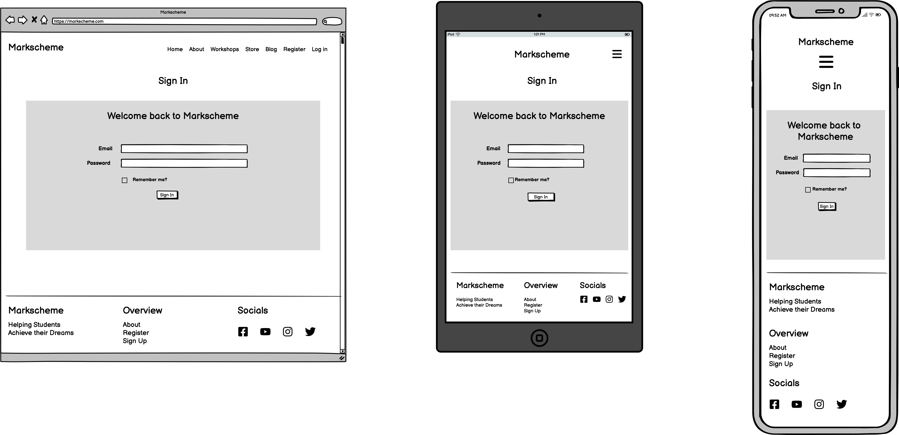

# Welcome to Markscheme

Markscheme is an online e-commerce store that allows teachers and tutors to advertise and sell educational products to children and teenages who are preparing for exams. The store allows the owners to create two types of products: Workshops and Digital Downloads. Interested users can purchase a ticket to a workshop or purchase a digital download to help them improve their knowledge of topics they plan to take exams for.

 

# Project Planning 

## Business Model
Markscheme is intended to be a B2C, or Business to Customer e-commerce business. The business was developed to connect tutors and teachers with students who are preparing for exams or who simply wish to better understand a certain topic. Additionally, by allowing teachers to sell digital products, Markscheme allows teachers to make more income using their subject specialisation than if they were to just teach workshops. The student is able to search for and find the right product to help them best succeed at their exams. The business allows the site owners to sell two types of products—workshop attendance and digital products in the form of pdfs.

 
 

Purpose and Value

All students in the United Kingdom must pass a set of exams called GCSEs. Additionally, many go on to undertake A-Level or IB exams which typically allow the student to pursue a university education or work. Due to these requirements, many teenagers and parents are regularly looking for affordable, but effective tutoring and study materials. Markscheme meets this need by not only providing affordable tutoring and study material, but also by providing the teenager and parent the ability to choose between purchasing guided-tutoring sessions (called 'workshops') and self-guided handbooks (called 'digital products').
 

Site User/Customer Goals

<ul>
<li>Search for and easily find study materials to help them pass their exams</li>
<li>Be able to choose between products that offer guided instruction (i.e., workshops) or products that allow a self-teaching approach (i.e., digital products)</li>
<li>Assess digital products for sale by seeing how regularly the material is updated</li>
<li>Easily create an account and purchase products they are interested in</li>
</ul>

 

Site Owner Goals

<ul>
<li>Allow teachers and tutors to maximise potential teaching income by helping them reach larger audiences for planned teaching workshops</li>
<li>Allow teachers and tutors to earn passive income by selling pdf study guides</li>
<li>Allow teachers and tutors to share their passion for their subject with more students than is normally possible without internet marketing</li>
</ul>
 

Target Market and Customer Persona

The target market for this audience is teenagers and parents of both all of whom have an interest in finding accessible study material and/or tutoring to help the child/teenager pass GCSE, A-Level and/or IB exams. Due to the fact that all teenagers in England must pass GCSE exams, prices for study materials and tutoring for these exams can be expensive. Markscheme provides a service where teenagers and parents can search and find products that fit their needs and their budget.

 

## Marketing

Facebook Marketing

As I do not have a Facebook account and intentionally avoid social media for personal reasons, I opted to use Code Institute's mock Facebook wireframe and design a Facebook Marketing campaign there. The result can be seen below. A PDF version of this design is also available in the file list above.
 
 

Email Marketing

This project makes use of <a href="https://mailchimp.com/?currency=GBP" target="_blank">MailChimp</a> to undertake its email marketing campaigns. Site visitors are able to sign up to receive email newsletters in two methods. The first appears 5 seconds after the user visits the site for the first time (or the first time since their cache has been cleared). This newsletter signup form comes out from the bottom right of the screen on desktop and from the top on mobile. It prompts the site visitor to either fill in their first name, last name and email or to exit out of the form. See the image below.

 

 

The second method for the site user to sign up for the newsletter is via the smaller form in the footer. Unlike the first method, this smaller, more abbreviated newsletter form is always present on every single page of the website. This form only requests the user's email address, but otherwise does the same thing as the expanded form outlined above. See the image below.

 

SEO

I have implemented strong SEO marketing for this website. As the target audience will likely be using search engines like Google to find affordable exam preparation options, SEO marketing is a crucial marketing strategy for the success of this business. See below the code used for the SEO marketing on the base template (i.e., applied every page of the site) as well as the SEO score provided by Google's Lighthouse Analysis.

 

 

## User Stories
To access and read the user stories for this project, see my Github project [Markscheme User Stories](https://github.com/users/adamsburge/projects/4/views/1). Many of these user stories were taken from the Code Institute 'Boutique Ado' walkthrough project. However, some are unique to this project.

 

## Wireframes
I used [balsamiq wireframes](https://balsamiq.com/) to design the UX and UI of the site. Click the headings below to expand the sections and view the wireframes for each section of the website.
 
 

Home Page

About Page

Store Page

Workshops Page

Digital Product Detail Page

Workshop Detail Page

Blog and Blog Detail Page

 
Note: This section has not yet been added to the app. Future updates will include this feature.
 
 
Blog Page

 
Blog Post Page

Normal User Profile Page

Superuser Profile Page

Log In Page

Register for Account Page

 

## Databse Structures
The database models used for this project were expanded from the models used in Code Institute's 'Boutique Ado' walkthrough project. However, these have been adjusted and added to for the purpose of the current project. Notably, this project uses polymorphism to allow for inherited models which extend the use of the product model thereby allowing for more than one kind of product (i.e., Workshops and Digital Products). Additionally, this project expands the user model beyond that created Code Institute's in the Boutique Ado project.

Additionally, the current project has one extra model not depicted in the database schema below—the updates model. This model is used to store news/updates regarding both digital products and workshops. This model can be found in the [models.py file of the products app](products/models.py).

# App Overview
## Pages

Home Page

About Page

Staff Page

Product Pages

Workshops Page

Add Workshop Page

Workshop Detail Page

Digital Products Page

Add Digital Product Page

Digital Product Detail Page

All Products Page

Checkout Pages

Bag Page

Checkout Form

Checkout Success

Profile Pages

Normal User Profile

Superuser Profile

Registration and Sign In Pages

Log In Page

Sign Up Page

 

## Features for Site Visitors

Register for Account

Any site visitor can register for an account. Once they have done so, they can sign in and out.

Browse the Website

All site visitors can access the home, about, staff pages. Additionally, all vistors to the website can see all the workshops and digital products the company has on offer.

View Updates to Products

Any site visitor is able to see updates that have been listed for both workshops and digital products. This allows the customer to make an informed decision when considering purchasing the product as it allows them to see the developments the product has had over time.

 
 
However, site users are only able to see product updates which the superusers have indicated is a 'Major Update' (which the superuser does by checking a box when updating the product). This allows the superusers to update the products and only show updates to site users that are relevant to the customer. For example, a superuser might choose to indicate that a new release of a handbook is a major update, but indicate that correcting a typo in the description is a minor update and consequently not something the customer needs to be aware of.

 

## Features Users with Profiles

Add Item to Bag and Checkout

As this site sells digital files, it is important for customers to have an account. Having an account allows the user to access the any purchased digital products. If the site visitor does not have an account or is not logged in, they will be unable to add a product to their bag (and consequently to checkout) and will be prompted to create an account.

Limited to One Item Per Product in Bag

As this webapp is intended to sell workshop attendance and digital products, all users are limited to one purchase per product. If users add an item to their basket, the 'Add to Basket' button disappears and an info box appears informing them that they already have this item in their bag. Users who wish to purchase attendance to workshops for other students are encouraged to create accounts for those students. 
 

Limited to One Purchase Per Product

As this webapp is intended to sell workshop attendance and digital products, all users are limited to one purchase per product. If users have purchased a product and return to the product's page (where they can access the download link), the 'Add to Bag' button no longer appears. If the product is a digital product, the 'Add to Bag' button is replaced with the button to download the file.

Update Billing Details and View Purchase History

Users who have signed up for an account have access to their account and can update their billing details and see their previous orders. Additionally, in their order history, they will find all the information they need for attending workshops (i.e., location, date, time, teachers) as well as the download links for any purchased digital files.

 

## Features for Admin Only

Add, Edit and Delete Products

Site superusers are able to add, edit, and delete both workshops and digital products. 
 
 
If a site user edits a workshop or digital product, they will also be prompted to add a reason for editing the product. This update form allows the site user to indicate whether the update is major (i.e., is an update the customer should know about such as a new version of a handbook or a change of venue for a workshop) or not (i.e., correcting a typo). If the superuser indicates that the update is major, the update details will be posted at the bottom of the product detail page.

Edit Personal Profile Information

When site superusers visit their profile page, they will find a different view than when a non-superuser visits their profile page. On the left side of the superuser's profile page is a form that allows the superuser to update their profile/bio information that appears on the staff page.

View Attendance List

On the right side of the superuser's profile page superusers are able to see a list of workshops which they are teaching as well as the attendance lists for those workshops.

 

# Technologies

### Languages
- HTML
- CSS
- Python
- Javascript
- Postgresql

### Libraries, Frameworks, Programmes & Tools
- Github - Version control and storing code 
- VSCode - Coding platform
- Django - Primary coding framework
- Psycopg2 - Databse adapter between Postgreql and Python
- Cloudinary - Media storage
- Herokuapp - Web app deployment
- Allauth - Building user registration 
- Gunicorn - Python Web Server Gateway Interface HTTP server
- Django-Summernote - Allow forms to have customisable input
- Django-Crispy-Forms - Build comment forms
- Bootstrap - General Styling
- FontAwesome - Icons for webapp
- Google Fonts - Fonts

# Testing
To read about the manual testing employed in this project, read the [TESTING.md file](TESTING.md).
 
 

# Deployment
To read about how this site was deployed and learn how to duplicate it, read the [DEPLOYMENT.md file](DEPLOYMENT.md)。
 
 

# Credits
- General Layout:
    - The general layout of this app is based on Code Institute's Boutique Ado project. However, much has been changed for this project in terms of layout and aesthetic. Moreover, the aesthetic is my own design and was made with adobe color.
- Concept:
    - The concept of this app is my own.
- Content:
    - The content of this website is entirely fictitious.
    - The photos on this site come from UnSplash and I am very grateful for the photographers who provided such incredible photos
    - The no_image file used for when there is no image to display, comes from [this wikimedia url](https://commons.wikimedia.org/wiki/File:No_Image_Available.jpg)
- Code: 
    - I spent several hours watching videos by John Elder on his channel [Codemy.com](https://www.youtube.com/playlist?list=PLCC34OHNcOtqW9BJmgQPPzUpJ8hl49AGy), particularly his Django Wednesdays playlist. It would be impossible to list every line of my code that was influenced by his videos, though his most significant influence was in helping solidify my understanding of the Django framework as a whole.
    - Various forums such as Stack Exchange and Stack Overflow helped to solve small problems when I was stuck on a line of code.
- Individuals:
    - My Mentor, [Adegbenga Adeye](https://github.com/deye9), provided comments and feedback.
    - My wife, Megan, provided wonderful feedback, and, most importantly, saw me through the project by making every break a delight.
