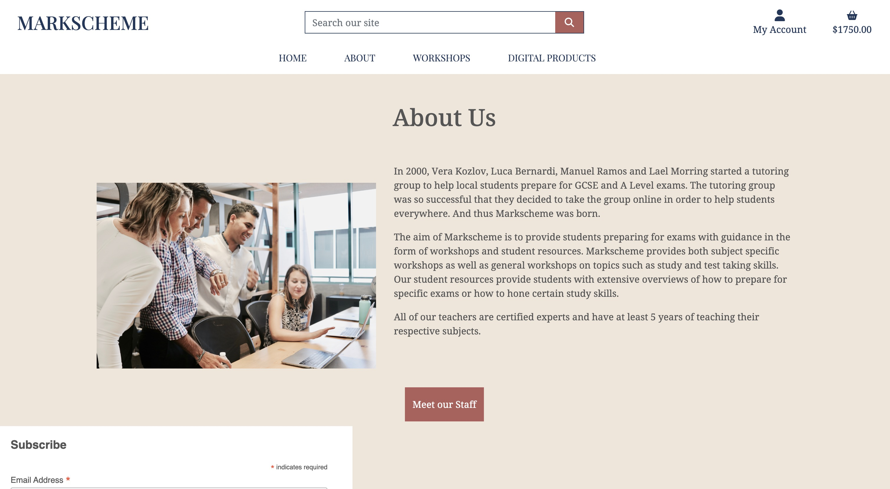
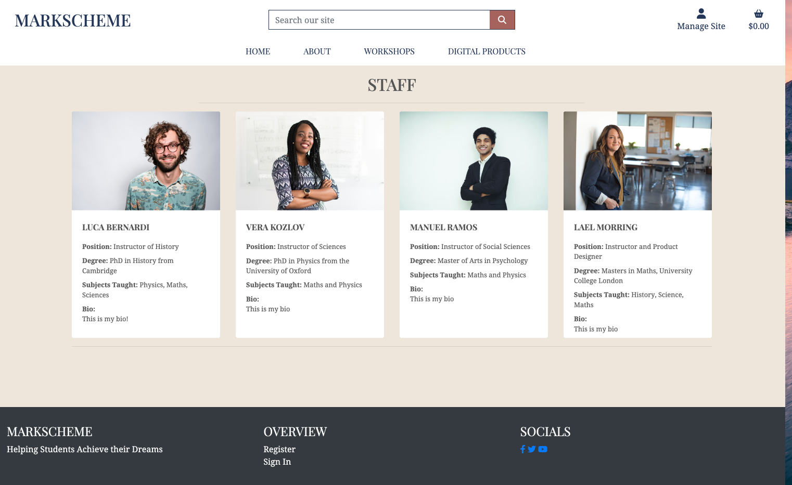
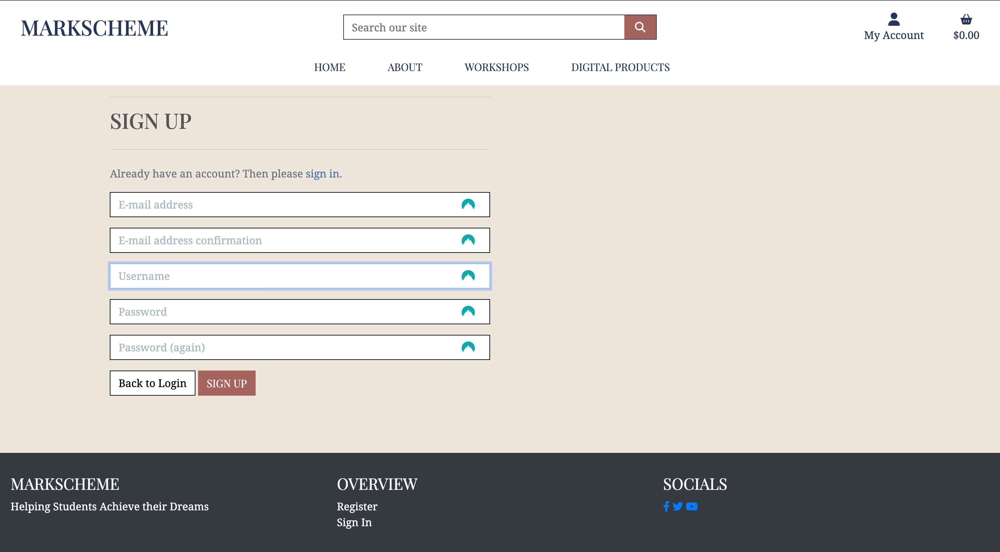
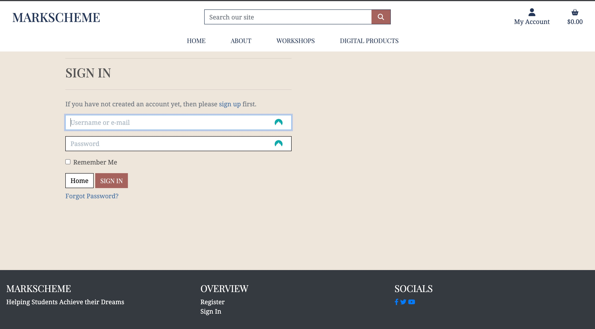

# Welcome to Markscheme

Markscheme is an online ecommerce store that allows teachers and tutors to advertise and sell educational products to children and teenages who are preparing for exams. The store allows the owners to create two types of products: Workshops and Digital Downloads. Interested users can purchase a ticket to a workshop or purchase a digital download to help them improve their knowledge of topics they plan to take exams for.

# Project Planning 

## Wireframes
I used [balsamiq wireframes](https://balsamiq.com/) to design the UX and UI of the site. 

### Home Page

### About Us

**Note**: This page is not yet completed and could be a future development of the site.

### Staff Page

### Register

### Sign in

### User Stories
To access and read the user stories for this project, see my Github project [Markscheme User Stories](https://github.com/users/adamsburge/projects/4/views/1). Many of these user stories were taken from the Code Institute 'Boutique Ado' walkthrough project. However, some are unique to this project.

### Databse Structures
The database models used for this project were expanded from the models used in Code Institute's 'Boutique Ado' walkthrough project. However, these have been adjusted and added to for the purpose of the current project. Notably, this project uses polymorphism to allow for inherited models which extend the use of the product model thereby allowing for more than one kind of product (i.e., Workshops and Digital Products). Additionally, this project expands the user model beyond that created Code Institute's in the Boutique Ado project.

# Features

## General Features

### Sign up, Sign in, Sign Out
Any site visitor can register for an account. Once they have done so, they can sign in and out.

## Features for Site Visitors and Normal Users

### Browse the Website, Purchase Products
All site visitors can access the home, about, staff pages as well as the checkout process. Site visitors have the option to registor for an account when checkout out and consequently keep track of their purchases.

## Features Users with Profiles

### Update Billing Details and Purchase History
Users who have signed up for an account have access to their account and can update their billing details and see their previous orders. Additionally, in their order history, they will find all the information they need for attending workshops (i.e., location, date, time, teachers) as well as the download links for any purchased digital files.

## Features for Admin Only

### Add, Update and Delete Posts
Super users are able to see a list of classes which they are teaching as well as the attendance lists for those classes

# Technologies

### Languages
- HTML
- CSS
- Python
- Javascript
- Postgresql

### Libraries, Frameworks, Programmes & Tools
- Github - Version control and storing code 
- Gitpod - Coding platform
- Django - Primary coding framework
- Psycopg2 - Databse adapter between Postgreql and Python
- Cloudinary - Media storage
- Herokuapp - Web app deployment
- Allauth - Building user registration 
- Gunicorn - Python Web Server Gateway Interface HTTP server
- Django-Summernote - Allow forms to have customisable input
- Django-Crispy-Forms - Build comment forms
- Bootstrap - General Styling
- FontAwesome - Icons for webapp
- Google Fonts - Fonts

# Testing
To read about the manual testing employed in this project, read the [TESTING.md file](TESTING.md).

# Deployment
This project is deployed using Heroku and AWS S3

Steps for Deployment:
1. Fork or Clone this Depository
2. Create new Heroku app
3. Install django
4. Create a free account with Elephantsql, obtain a database url and put it into the env.py file
5. Create a unique secret key and put that into the env.py file
6. Set up account with Amazon S3:
   1. Create bucket
   2. Give bucket permissions 
7. Make migrations
8. Link the Heroku app to the repository
9. Push to Heroku

# Credits
- Deployment aesthetic:
    - The general layout of this app is based on Code Institute's Boutique Ado project The aesthetic, however, is my own design and was made with adobe color.
- Concept:
    - The concept of this app is my own.
- Content:
    - The content of this website is entirely fictitious.
    - The photos on this site come from UnSplash and I am very grateful for the photographers who provided such incredible photos
    - The no_image file used for when there is no image to display, comes from [this wikimedia url](https://commons.wikimedia.org/wiki/File:No_Image_Available.jpg)
- Code: 
    - I spent several hours watching videos by John Elder on his channel [Codemy.com](https://www.youtube.com/playlist?list=PLCC34OHNcOtqW9BJmgQPPzUpJ8hl49AGy), particularly his Django Wednesdays playlist. It would be impossible to list every line of my code that was influenced by his videos, though his most significant influence was in helping solidify my understanding of the Django framework as a whole.
    - Various forums such as Stack Exchange and Stack Overflow helped to solve small problems when I was stuck on a line of code.
- Individuals:
    - My Mentor, [Adegbenga Adeye](https://github.com/deye9), provided comments and feedback.
    - My wife, Megan, provided wonderful feedback, and, most importantly, saw me through the project by making every break a delight.
