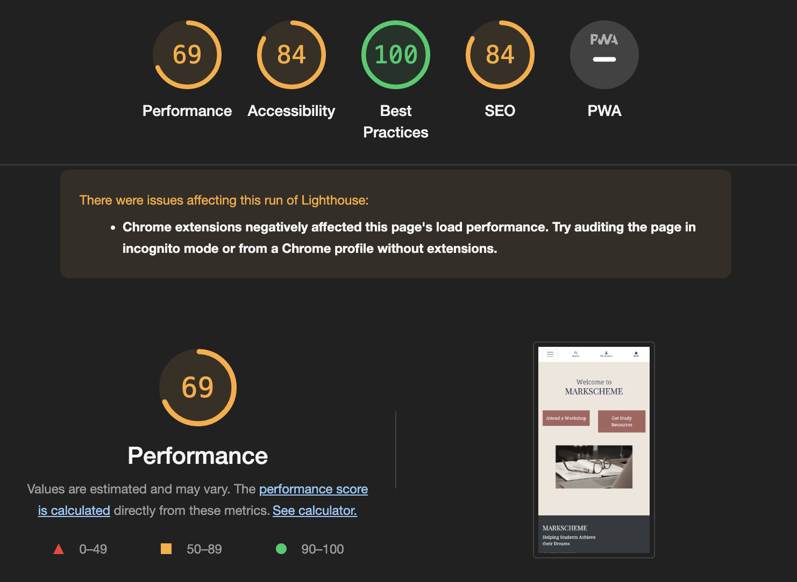
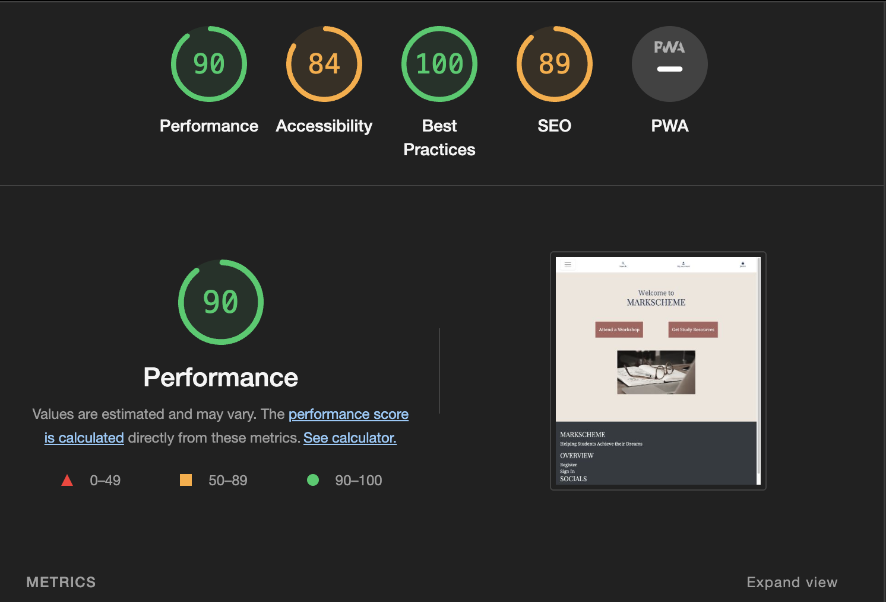

# Testing

## Responsive Testing
- Throughout the project:
    - The webapp has been manually tested for desktop on Google Chrome, Microsoft Edge, Firefox, Safari, Vivaldi and Arc. 
    - The webapp has been manually tested for mobile responsiveness on an iPhone 7, iPhone 8, and iPhone 14. The webapp has also been manually tested on an iPad 9th generation and an Onyx Boox NoteAir (1st generation). Additionally, Google devtools, [Am I Responsive?](https://ui.dev/amiresponsive) and [Screenfly](https://screenfly.org/) have been used to test the webapp on various other Apple and Android mobile phones and tablet devices from the iPhone 4 onward. 
    - The webapp looks good on all the major desktop web browsers and all the most popular tablet and mobile devices. I can confirm that the website looks good on all screensizes.

## Code Validator Testing

HTML:

The HTML for every webpage on this site has been checked for errors with the <a href="https://validator.w3.org/nu/">W3 NU HTML Checker</a> and cleared with no errors reported. Click below to see the validator testing scores.

 

Home Page

About Page

Staff Page

Product Pages

Workshops Page

Add Workshop Page

Workshop Detail Page

Digital Products Page

Add Digital Product Page

Digital Product Detail Page

All Products Page

Checkout Pages

Bag Page

Checkout Form

Checkout Success

Profile Pages

Normal User Profile

Superuser Profile

Registration and Sign In Pages

Log In Page

Sign Up Page

 

CSS:

The CSS for the site has been checked for errors with the <a href="https://jigsaw.w3.org/css-validator/">W3C CSS Validator</a> and passed with no errors found.

 

Javascript:

The Javascript for the site has been checked for errors with the <a href="https://jshint.com">JSHint Website</a> and no errors were found.

Python:

The Python for this site has been linted by both the built-in linter in VSCode as well as the <a href="https://pep8ci.herokuapp.com/">Code Institute Pep8 linter</a>. No significant errors were found other than indications that some lines were too long and warnings where I preferred to use tabs instead of spaces.

## Accessibility:
- I have checked the site for accessibility with Google's Lighthouse tool.
    - For Mobile: 
        
        
        
    - For Desktop:
        

## Bugs

### Solved
- Deployment to Heroku
    - When I initially attempted to deploy this project to Heroku (using AWS S3 for static files), I was unable to get my static files to load to AWS S3. I managed to solve this when I found that I had an unneccessary environment variable that was preventing me from uploading static files.

### Unsolved
- Subscription form:
  - As I ran out of time, I was unable to place the subscription form in a better place. In the future 
- Several purchases allowed:
  - At the moment, users are allowed to repurchase an item that they already own. In the future, I could prevent this and redirect them to the page where they could download the file.
- No Messages:
  - In the interest of time, I did not add messages to this webapp. However, most of the functionality is place to display these messages. This is certainly something that could be done in the future.